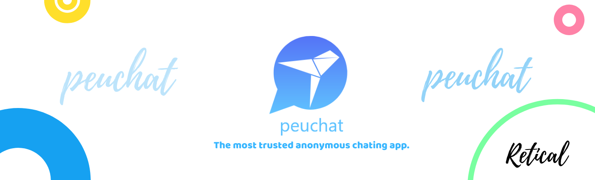
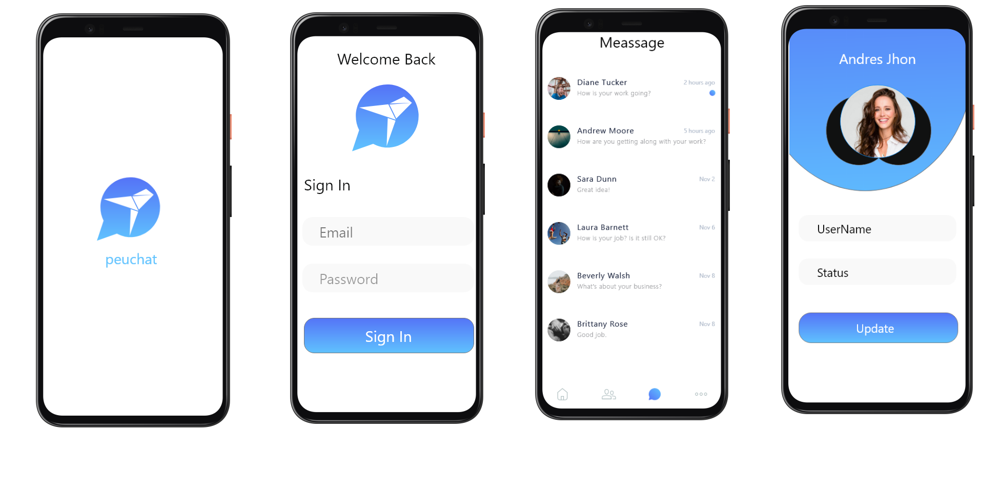
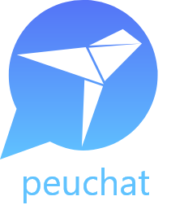

  

<h1 align="center">
  peuChat
</h1>

 

## What is peuChat?
* peuChat -The most trusted anonymous👀 chating app.

##### peuChat is an anonymous chat app for anyone who does not want to reveal his or her identitiy. No personally identifiable information is revealed. A peu Id  is generated for every user which is the only way to connect to the other one. Chat and become friends

# How to📲 Download SpotVital?

* Visit 👀 https://play.google.com/store/apps/details?id=com.e.chatingapp

# ScreenShots💕

  

# How to Use ✔📲 SpotVital?

* Step-1: Visit👀 https://play.google.com/store/apps/details?id=com.e.chatingapp
* Step-2: Download the App ✔
* Step-3: Now Create Account.👨‍🎓
* Step-4: Now add 🛸peuID to add Friends.
* Step-5: Now you have that person in your Contacts.

# Request from Retical
* Rate our app on  google Play store ⭐⭐⭐⭐⭐
* Comment and tell us about your experience 📱
* Our team will help you 24X7😎😎

# Retical © 
## Developers
* 🧒🏻 Rhythm Verma :https://github.com/ritmojs

# ThankYou ❤

<h1 align="center">
   © peuChat 2020
</h1>

